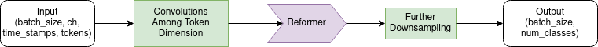

# COVIDetector Model

Code is based off of [this](https://github.com/epfml/attention-cnn) repository.

A prelimenary model used to classify voice samples, using the latest findings in NLP. A figure of the model is shown below



### Reproduce
To run the code on a Arch Linux machine for a CPU, use these commands in a new Python 3.8+ environment:

```
pip install -r requirements.txt
```

To run the code with a GPU, use these commands in a new Anaconda enviornment:

```
conda install pytorch torchvision cudatoolkit=10.0 -c pytorch
pip install -r requirements.txt
```

### Add your own model!
Want to add your own model? The model is easily extensible; simply add it as your own model in the `models` directory, and make the appropriate changes to the configuration and the `get_model` command in `train.py`.

### Data source
The data source, or where the json data is downloaded from, has to be in the `json` format:

```
[{
    "patient": "anonymized 32 byte id of patient, something like bec050243fd8a1a4d0e2c79e6ab8ba50acc7c8bcc9e7d873ec3bd500d68dac90",
    "created_at": "time sample was created",
    "url": "url to download the wav file",
    "sick": boolean
}]
```
All other fields are optional.
